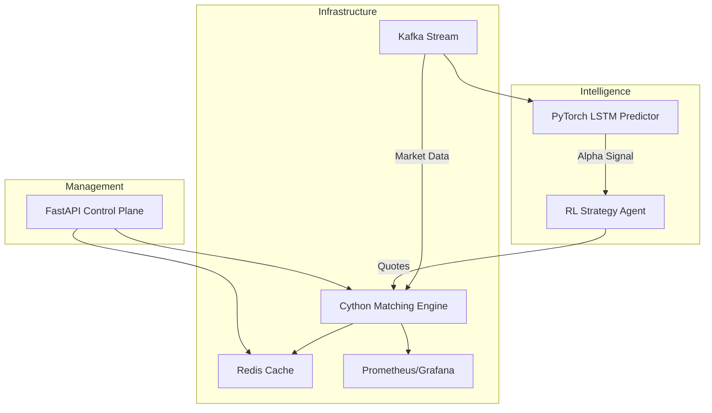

# HFT-MMS (High-Frequency Trading Market Making Simulator)


An **ultra high-class, institutional-grade** algorithmic trading and market making framework. 

Built to mirror the exact technological stacks utilized by Tier-1 quantitative hedge funds and proprietary trading firms. It features nanosecond-latency C-extensions, real-time distributed message brokering, and deep reinforcement learning.

## 🚀 State-of-the-Art Technology Stack

This repository is powered by a massive, distributed microservices architecture:

- **Cython**: The core matching engine is written in C-extensions to bypass the Python Global Interpreter Lock (GIL) and achieve microsecond execution latency.
- **Apache Kafka & Zookeeper**: Handles millions of Level-2 order book updates per second with fault-tolerant event streaming.
- **Redis**: Ultra-fast in-memory caching for tracking real-time Order Flow Imbalance (OFI) and inventory risk.
- **PyTorch & Stable-Baselines3**: Features a Deep Learning LSTM model for short-term price prediction, and a Reinforcement Learning agent that autonomously learns to market make.
- **FastAPI**: A high-performance async REST API providing a control plane to dynamically adjust risk limits and trigger the emergency kill-switch.
- **Docker Compose**: Entire infrastructure spins up instantly via containerization.
- **Prometheus & Grafana**: Real-time observability of PnL, latency, and alpha decay.

## 🏛 Distributed Architecture



## 🧠 Algorithmic Strategies
1. **Reinforcement Learning Market Maker**: Utilizes PPO (Proximal Policy Optimization) to dynamically learn optimal spread quoting based on inventory.
2. **Advanced Avellaneda-Stoikov**: A mathematical model that adjusts spreads dynamically based on Order Flow Imbalance (OFI) to prevent adverse selection.
3. **Statistical Arbitrage**: Cointegration-based mean reversion.
4. **VWAP / TWAP**: Institutional execution algorithms.

## 🛠️ Quick Start (Dockerized)

1. **Clone the repository:**
   ```bash
   git clone https://github.com/yourusername/market-maker-algo.git
   cd market-maker-algo
   ```

2. **Spin up the entire cluster:**
   ```bash
   docker-compose up -d --build
   ```
   This will automatically compile the Cython extensions and launch Kafka, Zookeeper, Redis, Prometheus, Grafana, and the Fast Trading Engine.

3. **Access the Control Plane:**
   Open your browser to `http://localhost:8000/docs` to interact with the FastAPI Swagger UI.

## 🛡 Risk Management (Circuit Breakers)

The `RiskManager` module acts as a strict compliance layer, monitoring:
- Absolute Position Limits (Delta Risk)
- Max Drawdown (Auto-Liquidation)
- Toxic Flow / Fat Finger Detection

## License
MIT License. See `LICENSE` for more information.
