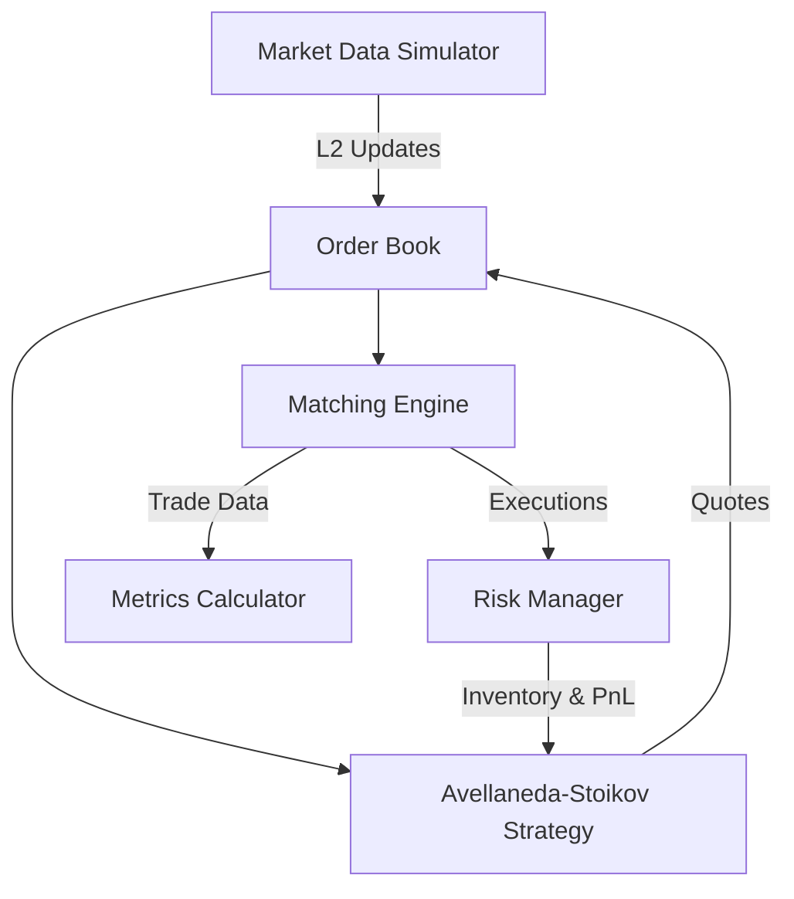

# High-Frequency Market Making Simulator (HFT-MMS)


An institutional-grade, event-driven market making algorithm simulation in Python. This repository implements a high-performance Level 2 Limit Order Book (LOB), a sophisticated matching engine, and an inventory-based trading strategy inspired by the classic **Avellaneda-Stoikov** (2008) model.

Built to mimic the micro-structural frameworks used by quantitative trading firms and Tier-1 market makers.

## 🏛 Architecture



## 🧠 The Strategy: Avellaneda-Stoikov

The core algorithm dynamically adjusts the bid-ask spread and its skew based on the current inventory risk and market volatility. 

### Reservation Price
The optimal price around which the market maker centers their quotes is shifted away from the mid-price based on their current inventory ($q$), risk aversion ($\gamma$), and market volatility ($\sigma$):

$$ r(s, t) = s - q \gamma \sigma^2 (T - t) $$

### Optimal Spread
The width of the quoted spread ensures profitability while compensating for adverse selection and inventory risk:

$$ \delta = \gamma \sigma^2 (T - t) + \frac{2}{\gamma} \ln\left(1 + \frac{\gamma}{k}\right) $$

## 🚀 Quick Start

1. **Clone the repository:**
   ```bash
   git clone https://github.com/yourusername/market-maker-algo.git
   cd market-maker-algo
   ```

2. **Install dependencies:**
   ```bash
   pip install -r requirements.txt
   ```

3. **Run the simulation:**
   ```bash
   python main.py
   ```

## 📊 Analytics & Reporting

The backtesting engine automatically calculates standard institutional metrics:
- **Total PnL** (Realized + Unrealized)
- **Sharpe Ratio** (Annualized)
- **Maximum Drawdown**

## 🛡 Risk Management

The `RiskManager` module acts as a circuit breaker, monitoring:
- Absolute Position Limits (Delta Risk)
- Max Drawdown (Stop Loss)
- Volatility spikes

## 🤝 Contributing
Contributions are welcome. Please ensure that the matching engine latency remains $O(1)$ for critical path operations.

## License
MIT License. See `LICENSE` for more information.
